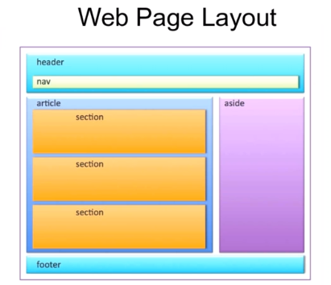
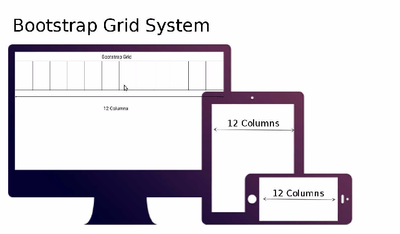
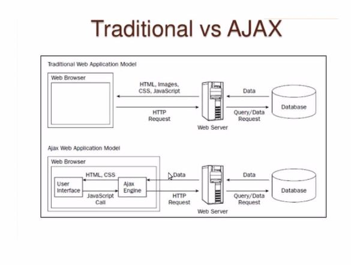
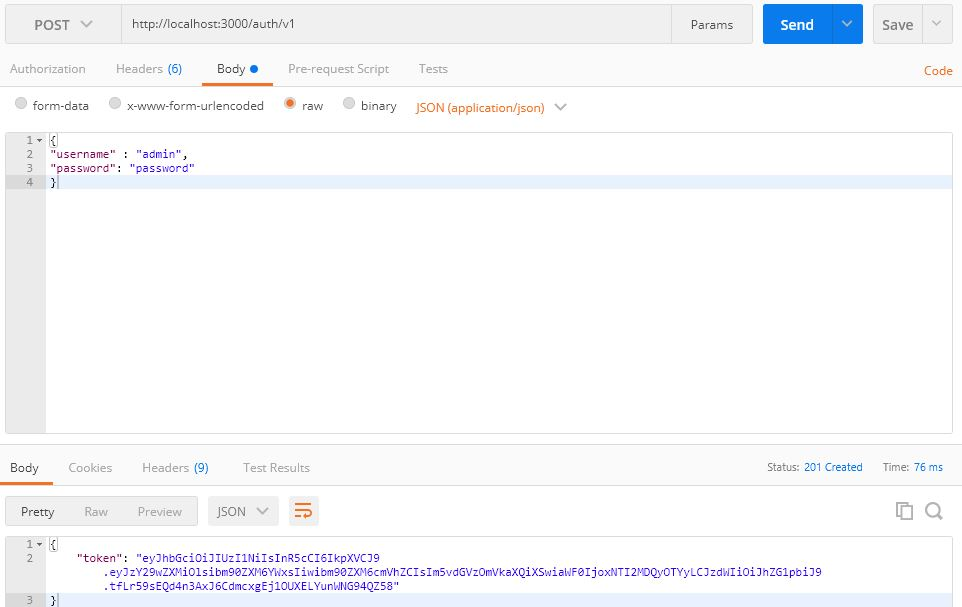
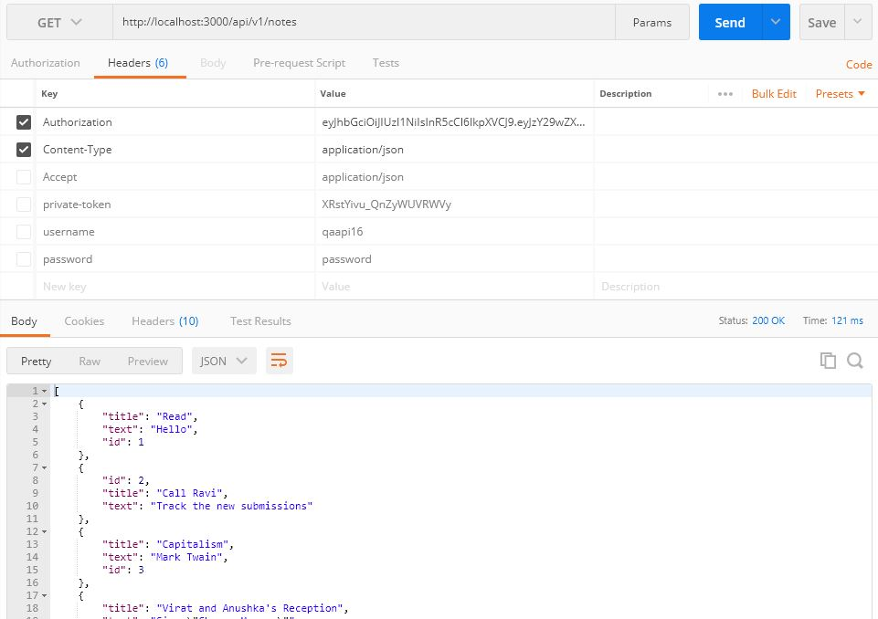
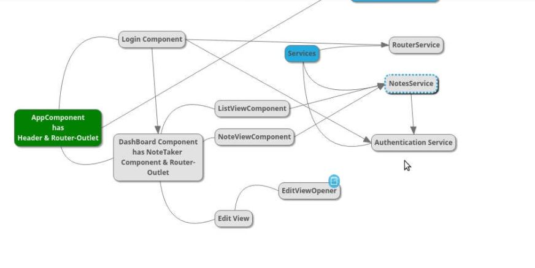

### tips:
vs code - add html5 boiler code extension. and in file type html5 it will show the link to generate code.
cntrl+sht+P => for running commands in vs code
vw/vh - takes full view port at any point of time
% - it depends on parent container. if a div has 100% then subsequent div or other elements can have 1-100%

#### proxy settings from organisation
npm config set proxy http://xxxxxxproxy xx:6050
npm config set https-proxy http://xxxproxyxxx:6050
npm config set strict-ssl false   
npm config set registry http://registry.npmjs.org/


# session 0 
## Intro to FSD
### install http-sever
httpserver is web container. install using npm globally
>npm install -g http-server
go to the folder and start the httpserver. it picks the index.html automatically
```
D:\JSworkspace\session2-paperbasedFlexLayout> http-server 
Starting up http-server, serving ./
Available on:
  http://10.xxx.xx.80:8080
  http://127.0.0.1:8080
Hi CTRL-C to stop the server
```
### inline vs block element
>**inline element** - takes required space eg: a tag, span, img,
to make inline to a block element use property - display:block 
**block element** - covers whole full width usually. eg: p, div, header elements, forms
To minimize the block element to take full width. use width:5em like this will reduce them.
All the html elements have - padding inside, border and margin.
there are **symentic elements** - header, footer, segments, aside, nav - this is to make web page logical divisions. though we can do without these and we can use only div to achieve
For elements like <scripts > default property is display:hidden thats why we are not seeing in the browser
border-radius:50% makes the block round.

### typical weblayout(though others are also available)

Though we able to do without semantic html elements. we can do all the segments in a div itself.

### px vs em  vs percentage
px - absolute scale
em - relative scale. realative to the font-size
% - also relative scale. relative to the block size

### fonts selection
[google fonts link](fonts.google.com) and link to the page

## parallex effect in the page or background image.
if 2 sections are there , make one section image is fixed using css. background-image:fixed which will make the parallex effect
# session 1
class-2 4/2/2018

### flex property
flex will arrange the element in a direction with proper distance between the elements.

The main idea behind the flex layout is to give the container the ability to alter its items' width/height (and order) to best fill the available space (mostly to accommodate to all kind of display devices and screen sizes). A flex container expands items to fill available free space, or shrinks them to prevent overflow.

Note: Flexbox layout is most appropriate to the components of an application, and small-scale layouts, while the Grid layout is intended for larger scale layouts.

#### sites to refer
(https://css-tricks.com/snippets/css/a-guide-to-flexbox/) - veru useful link for css
for check the frontend code - [code pen frontend editor online](https://codepen.io/pen) online workspace using your usual usermail/password. pon*****.mc*****@gmail.com/v******
demo url for today:


# session 2 - 4/4/2017
### position absolute and relative 
absolute  - 20px from top left and 20px from top 
relative  - relative to a element. 20px from previous element

### create hero image and text
(https://www.w3schools.com/howto/howto_css_hero_image.asp) - hero image tutorial

how to make image bright and image dull?
opacity css property to make image dull and text bright

add icons :
eg: take icons from the below site
(http://https://fontawesome.com/icons?d=gallery&q=copyright) - some fonts download

```
in html:
// add cdn of this site
copyright <i class="far fa-copyright"></i> 2018
```

### check whether latest feature is supporting in the browser like grid and flexbox etc
(http://https://caniuse.com/#feat=flexbox) - check the features supported in browser

# session 4 - responsiveness
- always design the page for small screen , medium and large screen 
- we need to use media queries to achieve and flexbox
- recently, from bootstrap 4 - they are using flex and media queries in them. so we can use them for responsiveness.
- we have css grids recently, for responsiveness we can use them as well. At present, though flex is supported widely.surely grids will be supported in coming years.

(https://getbootstrap.com/docs/4.0/layout/overview/ "bootstrap")
### bootstrap 
For responsiveness, they are using flex and media queries.Not only for responsiveness, bootstrap can be used for so many things. components, utilities are there.
### can refer the bootstrap examples
(https://getbootstrap.com/docs/4.0/examples/)
### documentations
(https://getbootstrap.com/docs/4.0/getting-started/introduction/)

# javascript
### Functions
function 1:
```
// Assign add function to sum constant
const sum = function add(x, y) {
    return x + y;
}

// Invoke function to find the sum
sum(20, 5);
```
function 2 - ananymous callback
```
const sum = function(x, y) {
    return x + y;
}
```
function 3 - arrow function
```
const multiply = (x, y) => {
    return x * y;
}
```
### callback Functions or higher order function
basic concept is function is given as a argument to a function.
very useful when library like jquery have a method we can simply pass methods we desire in our funciton argument itself.
```
//Note that the item in the click method's parameter is a function, not a variable.​
​//The item is a callback function
$("#btn_1").click(function() {
  alert("Btn 1 Clicked");
});
```
callback access global variable
```
//Global variable​
​var generalLastName = "Clinton";
​
​function getInput (options, callback) {
    allUserData.push (options);
​// Pass the global variable generalLastName to the callback function​
    callback (generalLastName, options);
}
```
eg1:
```
// Define an object with some properties and a method​
​// We will later pass the method as a callback function to another function​
​var clientData = {
    id: 094545,
    fullName: "Not Set",
    // setUserName is a method on the clientData object​
    setUserName: function (firstName, lastName)  {
        // this refers to the fullName property in this object​
      this.fullName = firstName + " " + lastName;
    }
}
​
​function getUserInput(firstName, lastName, callback)  {
    // Do other stuff to validate firstName/lastName here​
​
    // Now save the names​
    callback (firstName, lastName);
}

getUserInput ("Barack", "Obama", clientData.setUserName);
​
console.log (clientData.fullName);// Not Set​
​
​// The fullName property was initialized on the window object​
console.log (window.fullName); // Barack Obama
```
### For now, know that every function in JavaScript has two methods: Call and Apply. 
And these methods are used to set the this object inside the function and to pass arguments to the functions.
```
To avoid above code problems, we use apply /call here 
//Note that we have added an extra parameter for the callback object, called "callbackObj"​
​function getUserInput(firstName, lastName, callback, callbackObj)  {
    // Do other stuff to validate name here​
​
    // The use of the Apply function below will set the this object to be callbackObj​
    callback.apply (callbackObj, [firstName, lastName]);
}

// We pass the clientData.setUserName method and the clientData object as parameters. The clientData object will be used by the Apply function to set the this object​
getUserInput ("Barack", "Obama", clientData.setUserName, clientData);
​
​// the fullName property on the clientData was correctly set​
console.log (clientData.fullName); // Barack Obama
```
### multiple call background
```
function successCallback() {
    // Do stuff before send​
}
​
​function successCallback() {
    // Do stuff if success message received​
}
​
​function completeCallback() {
    // Do stuff upon completion​
}
​
​function errorCallback() {
    // Do stuff if error received​
}
​
$.ajax({
    url:"http://fiddle.jshell.net/favicon.png",
    success:successCallback,
    complete:completeCallback,
    error:errorCallback
​
});
```
### closures 
A closure is an inner function that has access to the outer (enclosing) function’s variables—scope chain. The closure has three scope chains: it has access to its own scope (variables defined between its curly brackets), it has access to the outer function’s variables, and it has access to the global variables.Closures are used extensively in Node.js; they are workhorses in Node.js’ asynchronous, non-blocking architecture. Closures are also frequently used in jQuery and just about every piece of JavaScript code you read.
```
$(function() {
​
​var selections = []; 
$(".niners").click(function() { // this closure has access to the selections variable​
selections.push (this.prop("name")); // update the selections variable in the outer function's scope​
});
​
});
```

# prototype
All JavaScript objects inherit properties and methods from a prototype.

Date objects inherit from Date.prototype. Array objects inherit from Array.prototype. Person objects inherit from Person.prototype.

The Object.prototype is on the top of the prototype inheritance chain:

Date objects, Array objects, and Person objects inherit from Object.prototype.

## events
Events are actions or occurrences that happen in the system you are programming.
For example, if the user clicks a button on a webpage, you might want to respond to that action by displaying an information box.
step1:
```
var btn = document.querySelector('button');
btn.onclick = function() {
  var rndCol = 'rgb(' + random(255) + ',' + random(255) + ',' + random(255) + ')';
  document.body.style.backgroundColor = rndCol;
}
function random(number) {
  return Math.floor(Math.random()*(number+1));
}

```

step2 - dont use often

```
<button onclick="bgChange()">Press me</button>

function bgChange() {
  var rndCol = 'rgb(' + random(255) + ',' + random(255) + ',' + random(255) + ')';
  document.body.style.backgroundColor = rndCol;
}
```

step3: frequently used
```
var btn = document.querySelector('button');

function bgChange() {
  var rndCol = 'rgb(' + random(255) + ',' + random(255) + ',' + random(255) + ')';
  document.body.style.backgroundColor = rndCol;
}   

btn.addEventListener('click', bgChange);

btn.removeEventListener('click', bgChange);
```
step4:
Sometimes inside an event handler function, you might see a parameter specified with a name such as event, evt, or simply e. This is called the event object, and it is automatically passed to event handlers to provide extra features and information
```
function bgChange(e) {
  var rndCol = 'rgb(' + random(255) + ',' + random(255) + ',' + random(255) + ')';
  e.target.style.backgroundColor = rndCol;
  console.log(e);
}  

btn.addEventListener('click', bgChange);
///Here you can see that we are including an event object, e, in the function, and in the function setting a background color style on e.target — which is the button itself. The target property of the event object is always a reference to the element that the event has just occurred upon. So in this example, we are setting a random background color on the button, not the page.

```
preventDefault - prevent default behaviour of the element here form is prevented from submitting 
```
form.onsubmit = function(e) {
  if (fname.value === '' || lname.value === '') {
    e.preventDefault();
    para.textContent = 'You need to fill in both names!';
  }
}
```

#### links to tutorial for functions
https://developer.mozilla.org/en-US/docs/Web/JavaScript/Guide/Functions

https://developer.mozilla.org/en-US/docs/Web/JavaScript/Reference/Global_Objects/Array

# session 6 - javascript DOM manipulation 13/4/2018
### for ilustration: table is created and form is created
git url of session - 
> fetch 1 dom element from form 
  getdocumentbyid
> many time dom element contains many inner elements. table contains so many inner element
  getelementbytagname[0] like that can be used.
  we can store them in array and can manipulate inside that
> filter operation is demonstrated in array ****
  (https://developer.mozilla.org/en-US/docs/Web/JavaScript/Reference/Global_Objects/Array/filter)
> form is ususally submitting the form to server. we can prevent form to submit and execute only the binding submit event.
  using - Event.preventDefault();
  (https://developer.mozilla.org/en-US/docs/Web/API/Event/preventDefault)

# session7 -REST demo javascript
### install json server 
   npm install json-server -g
 create a json file . access from json server 
  json-server db.json
 we can also use this json server to source html static pages
  create a public folder and put html files inside
  Access via >  json-server -s public db.json
 adding deleting the json using curl 
// default it get request
curl -X http://localhost:3000/contacts
//get the value from server 
curl -X GET http://localhost:3000/contacts
// post will add the new entry. put will modify the content 
curl -X POST http://localhost:3000/contacts -d '{"firsname": "Kalpana", "lastname": "D"}' -H "Content-Type: application/json"

curl -X DELETE http://localhost:3000/contacts/4
> similar to json xml is also used widely. if more validation to the data. xml can be used.

### Use ajax - get server data into the page.

(https://developer.mozilla.org/en-US/docs/Web/Guide/AJAX/Getting_Started)

### code ajax snippet 
> const httpRequest = new XMLHttpRequest();
httpRequest.open('GET','http://localhost:3000/contacts');
httpRequest.setRequestHeader('Content-Type','application/json');
// this is to change status code
httpRequest.onreadystatechange = function(){
if(httpRequest.readyState === 4){
console.log(httpRequest.status);
console.log(httpRequest.responseText);
}
}
httpRequest.send();

setTimeout(function(){
console.log(httpRequest.status);
},1000)
console.log(httpRequest.status);

# session8 - API demo
fork the demo project and its project is -
we are consuming api to this project

```
clone this project.
> npm install
> http-server -c-1
it is running the server the sample application
We are going to fetch git repository API to this project
```

sample API provided by gitlab itself- This is to fetch all the repositories in my account.
step1: go to this link - (https://gitxxxxxxx
 documentation for the access.
step 2: create a private token for you. settings -> user setting -> option to create access token
step 3: try with curl or postman
```
 curl --header "PRIVATE-TOKEN: 9koXpg98eAheJpvBs5tK" "https://gitlab-cts.stackroute.in/api/v3/projects"
 GET https://gitxxxxin/api/v3/projects
 headers: private-token: XRstYivu_QnZyWUVRWVy
```
### to get api data in a project - 
ajax can be used
sample online api services:
(https://jsonplaceholder.typicode.com/)
(https://reqres.in/)
(https://market.mashape.com/explore)

# session9 - fetch api and promises - 20/4/2018
if success do this else other stuff - this can be achieved using promise object

```
fetch('https://jsonplaceholder.typicode.com/posts/1')
  .then(response => response.json())
  .then(json => console.log(json))
```
asyncronous native js
2 ways:
xmlhttpobject - regular way we seen in last class 
Fetch API - uses promises object inside(IE not supported fetch)

# session 10 - serverside programing using Node
## module concept 
To make distributed loosely coupled code in js. 
Default node supports, common jS module type(export/ requires).
browser wont understand this module and all. to make browser understand,
packaging the files which will resolve to single file by packager like Browsify or webpack modules are resolved properly.
** we can also use react.js which in header. which able to resolve the modules and bundle together instead of webpack/browsify.
** apart from commonjs, AMD(asynchronous), ES5/6 modules can also be used .

**** very nice must watch (https://www.youtube.com/watch?v=U4ja6HeBm6s)


In Node 3 modules:
1. core module - node.js supplies when installed. eg: path,fs,http,util etc
2. local module - created by user
3. external module - 3rd party module . eg: express, http-server , gulp, grunt , mocha...


## getting started 
1. create a package.json - starting root file , dependency resolve, module resolving
```
> npm init
```
2. (https://nodejs.org/en/docs/guides/getting-started-guide/) copy paste the code to run http-server 
3. express : Express is a minimal and flexible Node.js web application 
framework that provides a robust set of features for web and mobile applications.
> this express frame work, has lot of features includes template engine rendering. 
  we use express with work with httpserver

# socket.io
used for realtime chat like applications.
```
session 11 
include in html

<script type="text/javascript" src="/socket.io.client/dist/socket.io.js">

..........
.........
inside script ----
const socket = io("http:localhost:3000");
socket.emit('message','this is coming from cleient');
```

# session 12 - Angular basics
assignment 1: refer sample keep.google.com
it is now framework not just - built on type script
(https://angular.io/guide/architecture)
concepts:
1. modularity in js 
must watch (https://www.youtube.com/watch?v=U4ja6HeBm6s) 
for modularity, why web packs or browsify to make into single files in browser side. server side they understand.

2. type script concepts 
3. components(html + css +ts )  concept
4. angular architecture 
```
angular cli :
tool to generate 
step1: npm install -g @angular/cli
step2: ng -v // to verify the installation
step3: ng new my-app
step 4: cd my app & ng serve --open // built with webpack and server running
```
sep 5: what is ecma script & concepts
```
step 6: ng test //refer app.component.spec.ts . 
it runs test suites jasmine framework & karma is the testeing runner 
     refer for testing: https://angular.io/guide/testing
     describe - test suite creation.
     testbed - simulate the environemnt
     fixture - provides the component instanses 
```

step 7: ng generate component header // creates new component 
include <app-header> in app.component.html  which wil bring the other component html page 
```
step 8: UI layer can use -material ui to display instead of header componetn .
follw steps from - https://material.angular.io/guide/getting-started
install the packages 
in app.module.ts - import {BrowserAnimationsModule} from '@angular/platform-browser/animations'; 
in styles.css - follow from the link 

optamistic UI concept - enter data in ui. save in db . and display again in UI
in optamistic Ui - enter data in ui and immediately display in ui itself then save in db.
```
to feature module concept :
ng generate module moduleName
you generated the module apart from ang inbuilt modules

to create component :
 ng generate component component name

## session 14 - angular forms
forms demo is given below:
https://github.com/blizzerand/Angular_Forms_Demo

# session 15 - angular routes
### created auth server 
1. auth server is created which accepted user/password and token is given 
refer - session15-routers folder -> auth-server to test. 


we run following commands before running the code. it also provides db.json data 
- npm install 
- npm start

### create router app
2. we are validating against the auth server. create a router application.
we have dashboard component, login component, note component.
we have services for authentication and routers. @injector is to lazy loading. occurs only when it needed


## session 17 - component interaction
overall structure of the project

### behaviours subject ****** very imprtant
inside rxjs
once change and broadcast. it is reflect everywhere.
(https://stackoverflow.com/questions/39494058/behaviorsubject-vs-observable)
(http://reactivex.io/rxjs/manual/overview.html)
(https://www.youtube.com/watch?v=sgK-tScQCvo)
### modal open
material UI


# session 18 - testing 
karma - test engine runner
jasmine - test framework to create test cases

ng test-> runs all the test
### To check the error and solve indidually
bygiving f- focus fdescribe you run in focus mode
eg:
import {MatToolbarModule} from '@angular/material';
fdescribe('HeaderComponent', () => {

### creating mocks for testing services
create modal class like note-stub.ts similar to note.ts 
and inject them into the test classes

FAQ:
### constructor vs ngOninit
```
export class App implements OnInit{
  constructor(){
     //called first time before the ngOnInit()
  }

  ngOnInit(){
     //called after the constructor and called  after the first ngOnChanges().
     //ngOnInit is a life cycle hook called by Angular2 to indicate that Angular is done creating the component,directives. not for services.
  }
}
```
# session 19 - angular directives
refer the project which contains the directive as well as testing stubs.
directive to add pink color when mouse over the note.
testing is for note module, header module , note taker

